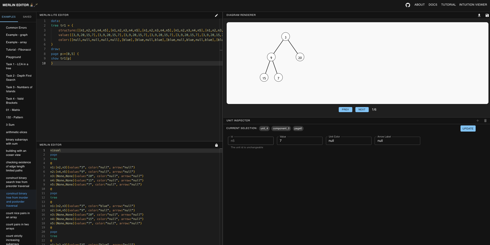

# About

### Abstract

**Merlin** is designed to empower instructors in creating visual aids like sketches, diagrams, and step-by-step animations to help learners grasp abstract programming concepts and develop accurate mental models. Traditionally, producing such visualizations, especially detailed animations, can be a time-intensive process.

Merlin addresses this challenge by introducing a **declarative language** specifically for algorithm animations and a streamlined **customized code editor** to simplify their creation. The design of Merlin is informed by an analysis of 400 examples from an online coding platform, examining their structure, common elements, and creation processes.

  

### Key Components

- **Merlin**: A powerful declarative language for algorithm animation.
- **Merlin-Lite**: A simplified version enabling concise and minimal code to define animations.
- **Merlin-Editor**: An intuitive tool that reduces the burden of fine-grained editing through direct manipulation.

The expressiveness of Merlin was demonstrated across a range of examples, and qualitative feedback from instructors highlights its usability and potential to transform the way educational visualizations are created. 

### Demos
Here is 5 minutes video to help fast understand **Merlin** project :)

  <video width="960" height="540" controls>
    <source src="demo-merlin-1080.mp4" type="video/mp4">
    Your browser does not support the video tag.
  </video>

### Related Work

### Contributor