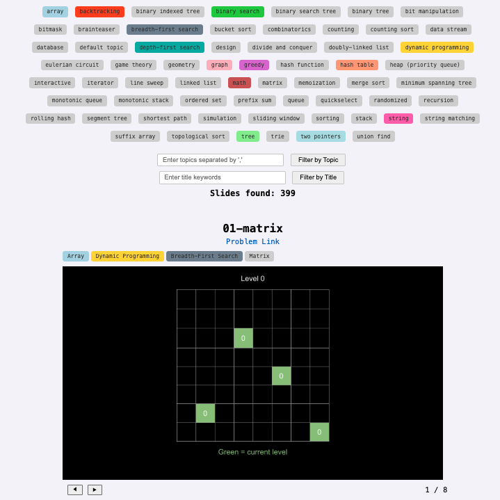
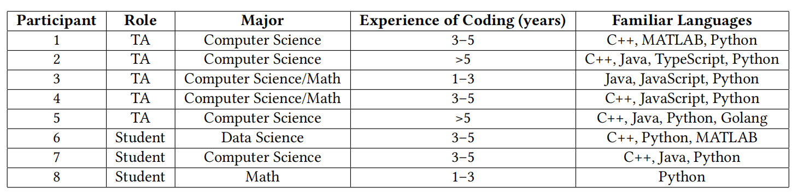
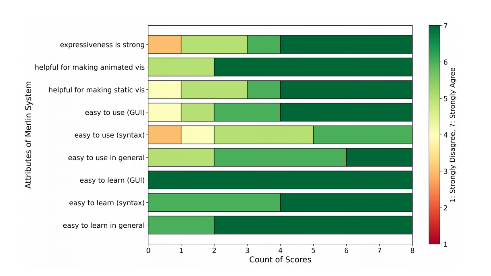

# About

### Abstract

**Merlin** is designed to empower instructors in creating visual aids like sketches, diagrams, and step-by-step animations to help learners grasp abstract programming concepts and develop accurate mental models. Traditionally, producing such visualizations, especially detailed animations, can be a time-intensive process.

Merlin addresses this challenge by introducing a **declarative language** specifically for algorithm animations and a streamlined **customized code editor** to simplify their creation. The design of Merlin is informed by an analysis of 400 examples from an online coding platform, examining their structure, common elements, and creation processes.

  

### Key Components

- **Merlin**: A powerful declarative language for algorithm animation.
- **Merlin-Lite**: A simplified version enabling concise and minimal code to define animations.
- **Merlin-Editor**: An intuitive tool that reduces the burden of fine-grained editing through direct manipulation.

The expressiveness of Merlin was demonstrated across a range of examples, and qualitative feedback from instructors highlights its usability and potential to transform the way educational visualizations are created. 

### Examples from Leetcode
We look through more than **2300** problems from popular coding website *Leetcode* and colloect **400** examples to explore the patterns hidden behind DSA visualization. The collected examples can be found on this [website](https://eth-peach-lab.github.io/intuition-visualisation/).

  

### Demo
Here is 5 minutes video to help fast understand **Merlin** project :)

  <video width="960" height="540" controls>
    <source src="demo-merlin-1080.mp4" type="video/mp4">
    Your browser does not support the video tag.
  </video>

### User Study

We conduct a user research consists of three parts: a tutorial session (15 minutes), a task session (45 minutes), and an interview
session (30 minutes). Task sessions involves four programming animation tasks sourced from online problem-solving platforms. These tasks are
arranged in increasing order of difficulty and animation complexity, ranging from modifying a provided single-page
animation to creating a complete algorithm animation from scratch.  

The background of participants in user study is summarized as the following table: 

  

  

And this is the after-survey of our user study. Most participants show positive feedback towards *Merlin*. For more detailed infomation, please refer to our related work. 

  

### Related Work

#### Thesis
[Merlin: A Markup Language for Algorithm Animations (2024)](Thesis_Merlin_v2.pdf)
Author: Shu Wang  
Supervisor: April Wang    

### Contributor
[Shu Wang](https://www.linkedin.com/in/shu-wang-488bb5138/)